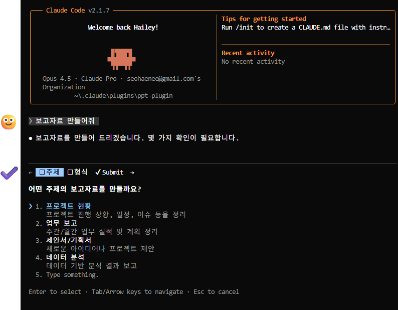
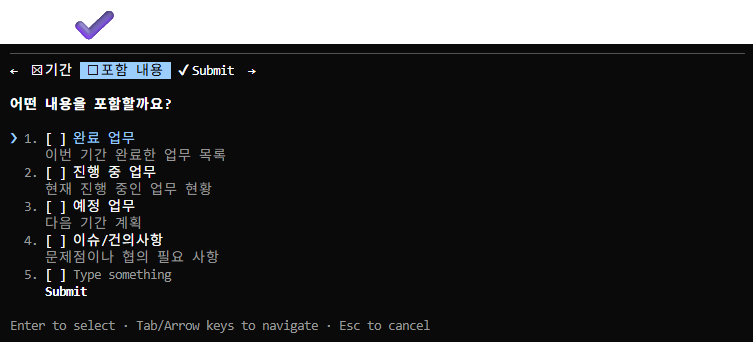
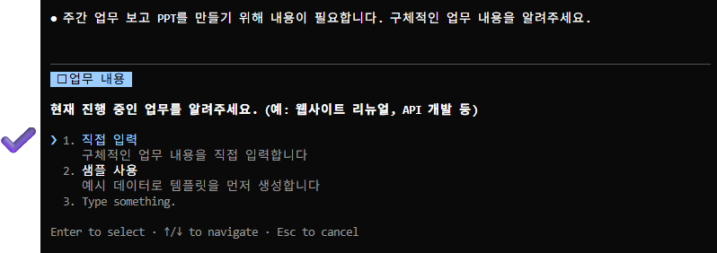
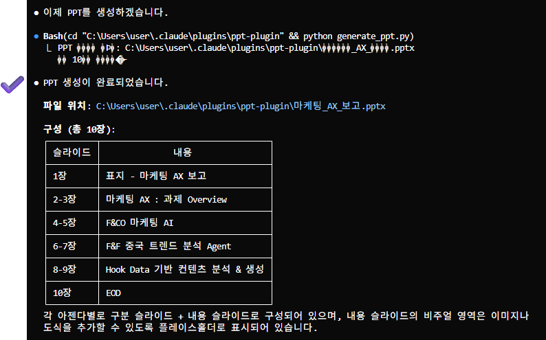
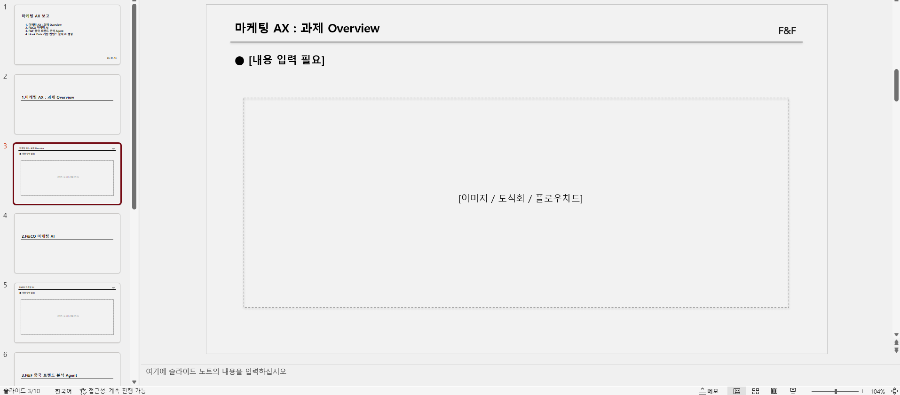

# 회장님 보고용 PPT 자동 생성 스킬 초기 버전

Claude Code에서 사용할 수 있는 PPT 자동 생성 스킬입니다.

## 사용 방법

### 1. Claude Code에서 요청
```
보고자료 만들어줘
```
또는
```
마케팅 AX 보고 PPT 만들어줘
```


*"보고자료 만들어줘" 입력*

### 2. 대화형 질문 응답

Claude가 순차적으로 질문합니다:


*"어떤 형식으로 만들까요?"*


*"어떤 내용을 포함할까요?"*


*"업무 내용"에 대한 세부 질문*

### 3. PPT 생성


*"이제 PPT를 생성하겠습니다"*

### 4. 결과물


*생성된 PPT 파일*

## 슬라이드 구성

| 슬라이드 | 설명 |
|---------|------|
| 표지 | 제목 "마케팅 AX 보고" + 아젠다 목록 + 날짜 |
| 아젠다 구분 | 각 아젠다 시작 전 구분 슬라이드 |
| 본문 | 아젠다별 1-2페이지 내용 |
| EOD | 발표 종료 슬라이드 |

## 디자인 스펙

- **슬라이드 크기**: 와이드스크린 16:9
- **배경색**: `#F2F2F2`
- **폰트**: Pretendard (ExtraBold, SemiBold)
- **로고**: F&F 로고 (본문 슬라이드 우측 상단)

## 설치

1. 이 저장소를 `~/.claude/plugins/` 폴더에 클론
```bash
git clone https://github.com/your-repo/ppt-plugin.git ~/.claude/plugins/ppt-plugin
```

2. Claude Code 재시작

## 파일 구조

```
ppt-plugin/
├── skills/
│   └── ppt/
│       ├── SKILL.md          # 스킬 정의
│       └── fnf_logo.png      # F&F 로고
├── docs/
│   └── images/               # README 스크린샷
├── README.md
└── .gitignore
```

## 라이선스

Internal Use Only - F&F
