# FNF Studio Architecture

> FNF Studio는 패션 브랜드를 위한 AI 이미지 생성 플랫폼입니다.
> Gemini API 기반으로 브랜드컷, 배경교체, 시딩UGC, 일상컷 4가지 워크플로를 제공합니다.

---

## 1. 시스템 전체 구조

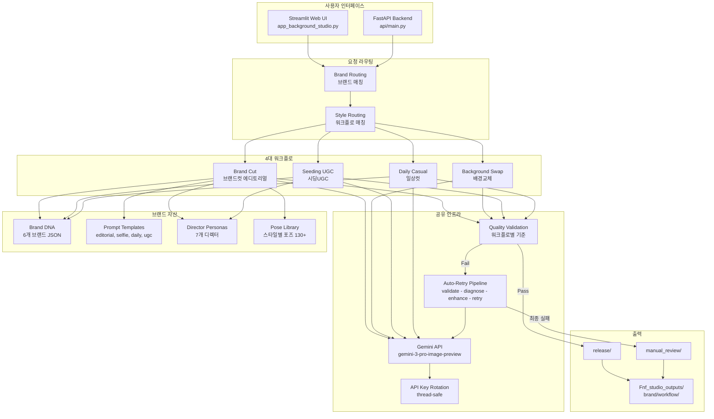

---

## 2. 문서 계층 구조 (CLAUDE.md vs SKILL.md)

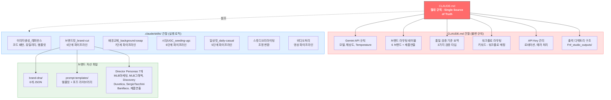

**핵심 원칙**: CLAUDE.md는 "무엇을 지켜야 하는가" (규칙), SKILL.md는 "어떻게 실행하는가" (로직)

---

## 3. 사용자 요청 라우팅

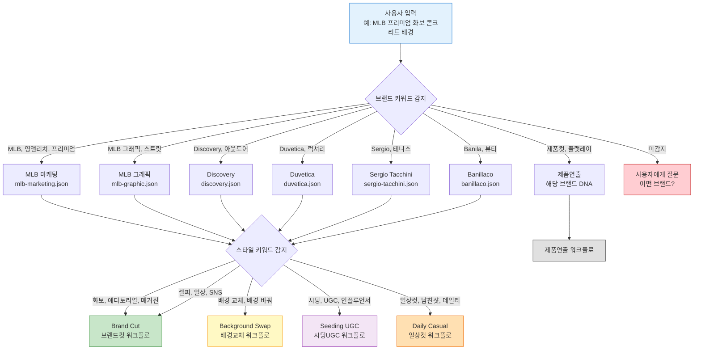

---

## 4. 워크플로 파이프라인 상세

### 4-1. Brand Cut (브랜드컷)

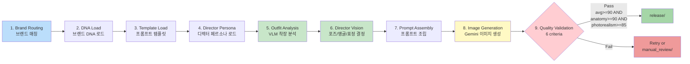

**검증 기준 (6 criteria)**:
| Criterion | 설명 |
|-----------|------|
| photorealism | 사진 같은 리얼리즘 (>= 85 필수) |
| anatomy | 해부학적 정확성 (>= 90 필수) |
| brand_compliance | 브랜드 DNA 준수도 |
| outfit_accuracy | 착장 정확도 |
| composition | 구도/프레이밍 |
| lighting_mood | 조명/분위기 |

**Pass 조건**: `weighted_avg >= 90 AND anatomy >= 90 AND photorealism >= 85`

---

### 4-2. Background Swap (배경교체)

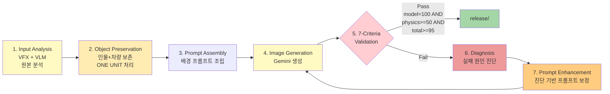

**검증 기준 (7 criteria, weighted)**:
| Criterion | Weight | 설명 |
|-----------|--------|------|
| model_preservation | 30% | 인물 보존도 (100 필수) |
| physics_plausibility | 15% | 물리적 타당성 (>= 50 필수) |
| ground_contact | 13% | 지면 접촉 자연스러움 |
| lighting_match | 12% | 조명 일치도 |
| prop_style_consistency | 12% | 소품/스타일 일관성 |
| edge_quality | 10% | 경계 품질 |
| perspective_match | 8% | 원근감 일치도 |

**Pass 조건**: `model_preservation = 100 AND physics_plausibility >= 50 AND weighted_total >= 95`

---

### 4-3. Seeding UGC (시딩UGC)

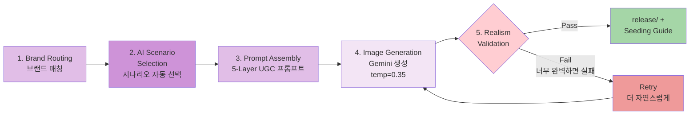

**핵심 원칙**: "너무 잘 나오면 실패" - 폰으로 대충 찍은 것 같아야 성공

**검증 기준 (5 criteria, UGC 전용)**:
| Criterion | Weight | 설명 |
|-----------|--------|------|
| ugc_realism | 35% | 실제 폰 촬영 같은 자연스러움 |
| person_preservation | 25% | 인물 보존도 |
| scenario_fit | 20% | 시나리오 적합성 |
| skin_condition | 10% | 피부 상태 자연스러움 |
| anti_polish | 10% | 과도한 보정 방지 (높을수록 좋음) |

---

### 4-4. Daily Casual (일상컷)

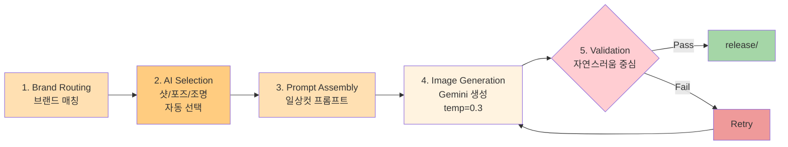

**검증 기준 (5 criteria)**:
| Criterion | Weight | 설명 |
|-----------|--------|------|
| naturalness | 30% | 전반적 자연스러움 |
| person_preservation | 25% | 인물 보존도 |
| camera_realism | 20% | 카메라 촬영 리얼리즘 |
| outfit_accuracy | 15% | 착장 정확도 |
| background_fit | 10% | 배경 적합성 |

---

## 5. 품질 검증 비교표

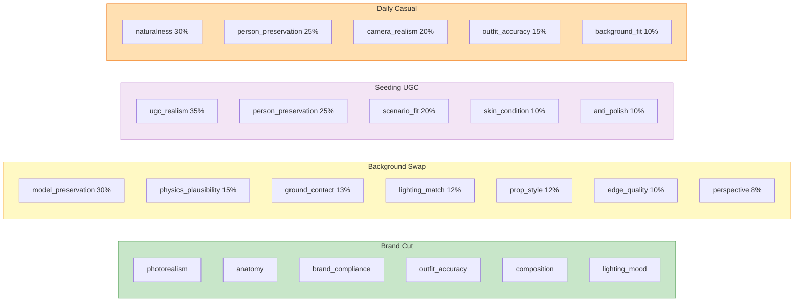

| 워크플로 | Pass 조건 | 특이사항 |
|----------|----------|---------|
| **Brand Cut** | avg >= 90, anatomy >= 90, photorealism >= 85 | 브랜드 준수 + 해부학 정확성 중심 |
| **Background Swap** | model = 100, physics >= 50, total >= 95 | 인물 절대 보존 + 물리 타당성 |
| **Seeding UGC** | UGC 리얼리즘 기반 | "너무 완벽하면 실패" 원칙 |
| **Daily Casual** | 자연스러움 기반 종합 평가 | 카메라 리얼리즘 중시 |

---

## 6. 공유 인프라

### 6-1. Gemini API 설정

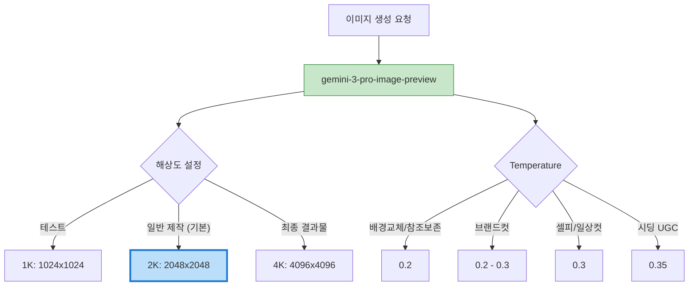

### 6-2. API Key 로테이션 및 에러 처리

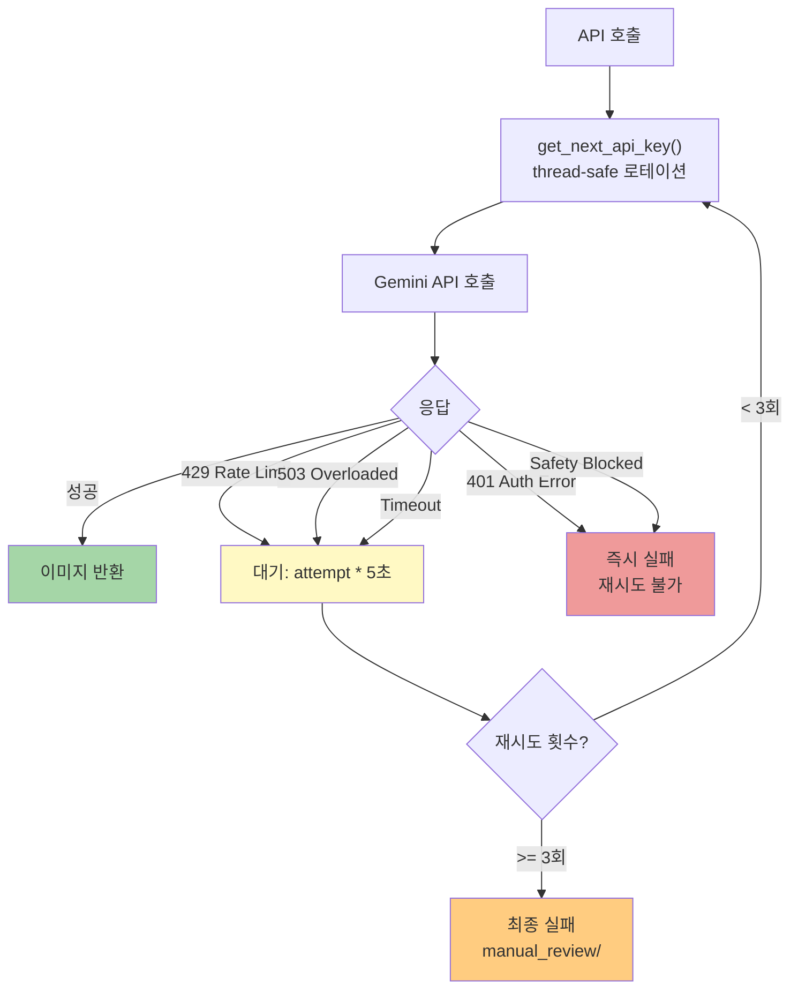

### 6-3. 출력 디렉토리 구조

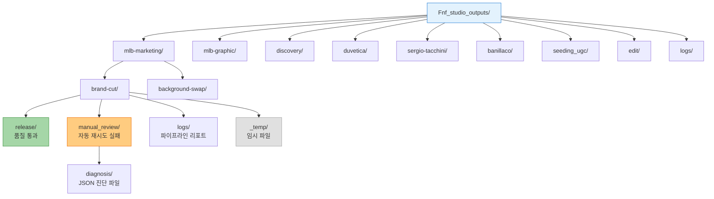

---

## 7. 코드 레이어

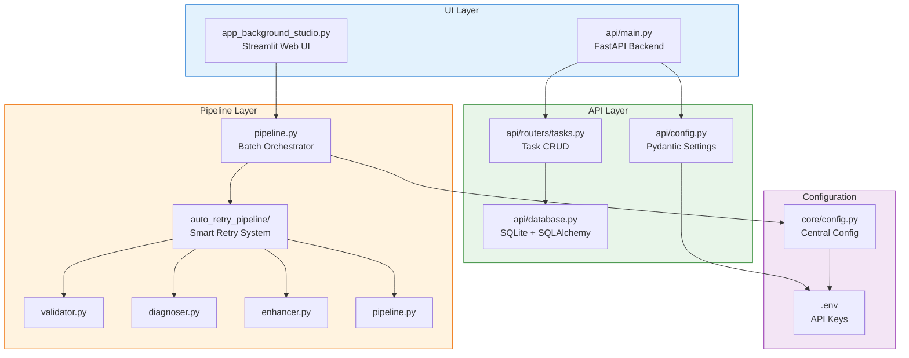

---

## 8. Brand Cut 상세 흐름도 (ASCII)

아래는 브랜드컷 에디토리얼 워크플로의 단계별 상세 흐름입니다.

```
                    [User Input: "MLB 프리미엄 화보 무대 백스테이지"]
                                        |
                                        v
+===============================================================================+
|  STEP 1: 브랜드 라우팅 (route_brand)                                           |
+===============================================================================+
|  brand-dna/_index.json                                                         |
|  +-----------------------------------------------------------------------+    |
|  | "MLB" in input?                                                        |    |
|  |   +-- "프리미엄, 시크, 화보" --> mlb-marketing                        |    |
|  |   +-- "스트릿, 그래픽"      --> mlb-graphic                           |    |
|  +-----------------------------------------------------------------------+    |
|  Output: brand = "mlb-marketing"                                               |
+===============================================================================+
                                        |
                                        v
+===============================================================================+
|  STEP 1.5: 스타일 라우팅 (route_style)                                         |
+===============================================================================+
|  brand-dna/_index.json --> prompt_engines                                      |
|  +-----------------------------------------------------------------------+    |
|  | "화보, 에디토리얼, 매거진" --> editorial                               |    |
|  | "셀피, SNS, 캐주얼"       --> selfie                                   |    |
|  +-----------------------------------------------------------------------+    |
|  Output: style = "editorial"                                                   |
+===============================================================================+
                                        |
                                        v
+===============================================================================+
|  STEP 2: 브랜드 DNA 로드 (load_brand_dna)                                      |
+===============================================================================+
|  brand-dna/mlb-marketing.json                                                  |
|  +-----------------------------------------------------------------------+    |
|  | _metadata: { persona: "Tyrone Lebon", brand: "MLB" }                   |    |
|  | identity:  { philosophy: ["가장 완벽한 공간을..."], mood: ["cool"] }   |    |
|  | keywords:  { style: ["old money meets streetwear"], ... }              |    |
|  | forbidden_keywords: { pose: ["활짝 웃는"], background: ["그래피티"] }  |    |
|  +-----------------------------------------------------------------------+    |
|  Output: brand_dna = { ... }                                                   |
+===============================================================================+
                                        |
                                        v
+===============================================================================+
|  STEP 2.5: 프롬프트 템플릿 로드 (load_template)                                |
+===============================================================================+
|  prompt-templates/MLB_editorial.json (우선)                                    |
|  prompt-templates/editorial.json (fallback)                                    |
|  +-----------------------------------------------------------------------+    |
|  | meta:      { aspect_ratio: "4:5", quality: "8k" }                      |    |
|  | subject:   { expression: "{brand_dna.xxx|confident}" }                 |    |
|  | outfit:    { style: "{brand_dna.keywords.style[0]}" }                  |    |
|  | pose:      { attitude: "bored chic, rebellious" }                      |    |
|  | scene:     { location: "{input.location|concrete garage}" }            |    |
|  | lighting:  { type: "hard directional", color_temp: "6500K" }           |    |
|  | technical: { camera: "Sony A7R V", lens: "35mm f/1.4" }                |    |
|  +-----------------------------------------------------------------------+    |
|  Output: template = { ... }                                                    |
+===============================================================================+
                                        |
                                        v
+===============================================================================+
|  STEP 3: 디렉터 페르소나 로드 (load_brand_director_skill)                       |
+===============================================================================+
|  (MLB마케팅)_시티미니멀_tyrone-lebon/SKILL.md                                  |
|  +-----------------------------------------------------------------------+    |
|  | 페르소나: Tyrone Lebon (The Old Money Rebel)                           |    |
|  | 철학:     "가장 완벽한 공간을, 가장 지루해하는 표정으로 장악"           |    |
|  | 스타일:   old money, bored rich kid, arrogant luxury                    |    |
|  | DO:       완벽한 배경에 삐딱하게 기대기, 시선 피하기                    |    |
|  | DON'T:    그래피티, 뒷골목, 활짝 웃음, 역동적 포즈                     |    |
|  | 포즈 130개 가이드라인                                                  |    |
|  +-----------------------------------------------------------------------+    |
|  Output: director_directives = { persona, philosophy, do_rules, ... }          |
+===============================================================================+
                                        |
                                        v
+===============================================================================+
|  STEP 4: 착장 분석 VLM (analyze_outfit)                                         |
+===============================================================================+
|  Gemini 2.0 Flash (3회 재시도)                                                  |
|  +-----------------------------------------------------------------------+    |
|  | 분석 항목:                                                             |    |
|  | +-- headwear: beanie, no_brim, mohair, fuzzy                          |    |
|  | +-- outer:    varsity jacket, satin, Red Sox script                   |    |
|  | +-- top:      tank top, black, MLB logo                               |    |
|  | +-- bottom:   cargo jeans, wide leg, NY logo                          |    |
|  | +-- bag:      shoulder bag, knit, NY pattern                          |    |
|  |                                                                        |    |
|  | ** 로고 위치 정확도 체크 (front_right, not front_center)               |    |
|  +-----------------------------------------------------------------------+    |
|  Output: outfit_analysis = { garments: [...], outfit_description: "..." }      |
+===============================================================================+
                                        |
                                        v
+===============================================================================+
|  STEP 5: 디렉터 비전 생성 (generate_director_vision)                            |
+===============================================================================+
|  Gemini 2.0 Flash (페르소나 롤플레이)                                           |
|  +-----------------------------------------------------------------------+    |
|  | variation_index=0~9 --> 10가지 포즈 라이브러리에서 강제 선택            |    |
|  |                                                                        |    |
|  | EDITORIAL 포즈 라이브러리:                                             |    |
|  | +-- 0: The Foot Rest (발 올리기, 로우앵글)                             |    |
|  | +-- 1: The Hood Lounger (보닛 위, 45도)                                |    |
|  | +-- 2: 쭈그려 앉아 턱 괴기 (로우앵글)                                   |    |
|  | +-- 3: 걷다가 뒤돌아보기 (측면)                                        |    |
|  | +-- 4: 바닥에 앉아서 (하이앵글)                                        |    |
|  | +-- ... (총 10가지)                                                    |    |
|  |                                                                        |    |
|  | ** 강제 적용: VLM 결과 위에 forced_pose/angle/expression 덮어쓰기     |    |
|  +-----------------------------------------------------------------------+    |
|  Output: director_vision = { pose_full, expression, camera_angle, ... }        |
+===============================================================================+
                                        |
                                        v
+===============================================================================+
|  STEP 6: 프롬프트 조립 (build_prompt_from_template)                             |
+===============================================================================+
|  변수 치환 + 병합                                                               |
|  +-----------------------------------------------------------------------+    |
|  | {                                                                      |    |
|  |   "meta":    { aspect_ratio, quality, camera, lens }                   |    |
|  |   "subject": { gender, age, expression <-- 강제적용, skin }            |    |
|  |   "outfit":  { items <-- 착장분석 or fallback, style }                 |    |
|  |   "pose":    { style <-- 강제적용, selfie_type, arm_position }         |    |
|  |   "scene":   { location <-- 디렉터비전, background, atmosphere }       |    |
|  |   "camera":  { angle <-- 강제적용, framing <-- 강제적용, lens }        |    |
|  |   "lighting": { type <-- 디렉터비전, quality, color_temp }             |    |
|  |   "style":   { persona, direction }                                    |    |
|  | }                                                                      |    |
|  |                                                                        |    |
|  | ** outfit.items 비어있으면 --> director_vision.outfit_highlight 사용    |    |
|  +-----------------------------------------------------------------------+    |
|  Output: prompt_json, negative_prompt                                          |
+===============================================================================+
                                        |
                                        v
+===============================================================================+
|  STEP 7: 이미지 생성 (generate_single)                                          |
+===============================================================================+
|  Gemini gemini-3-pro-image-preview                                              |
|  +-----------------------------------------------------------------------+    |
|  | 입력:                                                                  |    |
|  | +-- 모델 이미지 (얼굴 참조)                                           |    |
|  | +-- 착장 이미지 (옷 참조)                                             |    |
|  | +-- 최종 프롬프트                                                     |    |
|  | +-- 네거티브 프롬프트                                                 |    |
|  |                                                                        |    |
|  | 출력: PIL.Image                                                        |    |
|  +-----------------------------------------------------------------------+    |
+===============================================================================+
                                        |
                                        v
                              [생성된 이미지 저장 + 품질 검증]
```

---

## 9. 디렉터 페르소나 매핑

| 브랜드 | 디렉터 | 페르소나 특징 |
|--------|--------|-------------|
| MLB 마케팅 | Tyrone Lebon | 시티 미니멀, old money rebel, 무드 있는 권태로움 |
| MLB 그래픽 | Shawn Stussy | 스트릿 레전드, 올드스쿨, 그래픽 타이포그래피 |
| Discovery | Yosuke Aizawa | 테크니컬 유틸리티, 고프코어, 구조적 실루엣 |
| Duvetica | Brunello Cucinelli | 이탈리안 럭셔리, 장인정신, 절제된 우아함 |
| Sergio Tacchini | Hedi Slimane | 실루엣 혁명, 슬림핏, 록 앤 롤 미학 |
| Banillaco | Ahn Joo-young | 맑은 뷰티, Glass Skin, 투명 발색 |
| 제품연출 | Musinsa/29CM | 한국 힙 이커머스, 클린 미니멀, 감성 연출 |

---

## 10. 콘텐츠 타입별 기본 설정

| 타입 | Template | Aspect Ratio | Temperature | Model |
|------|----------|-------------|-------------|-------|
| Editorial / Brand Cut | editorial.json | 3:4 | 0.2 | gemini-3-pro-image-preview |
| Selfie | selfie.json | 9:16 | 0.3 | gemini-3-pro-image-preview |
| Daily Casual | daily_casual.json | 4:5 | 0.3 | gemini-3-pro-image-preview |
| Seeding UGC | seeding_ugc.json | 9:16 | 0.35 | gemini-3-pro-image-preview |
| Background Swap | background-swap.json | Original | 0.2 | gemini-3-pro-image-preview |
